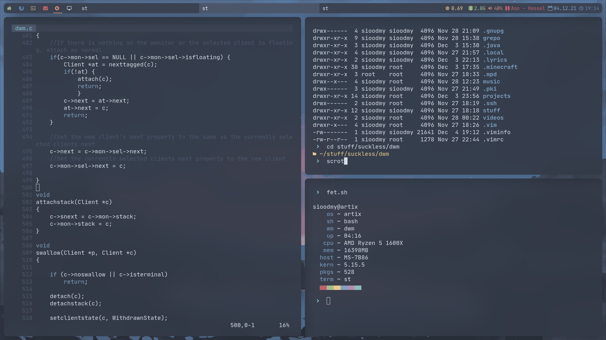

# My fork of dwm

# Features
* Gaps between windows
* Colorful tags
* Custom bar status
* Zen layout
* Keybinds configuration via sxhkd
* Awesome bar patch
* Independent of xsetroot

# Installation
Run `make clean install` as root
# Usage
Add `dwmbar &` and `exec dwm` to your .xinitrc file
You propably also should install and configure sxhkd
